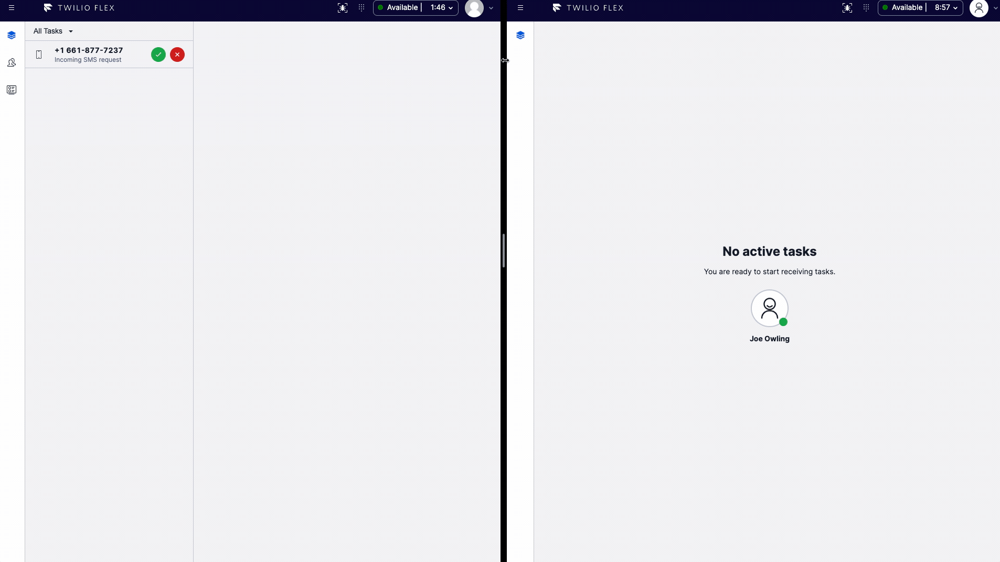

# Chat Transfer

This feature implements cold transfer of Flex Conversations Based Messaging (CBM) to a specific agent or to a queue.

It makes use of the existing worker directory but note that it removes the warm/consult transfer functionality as this is out of scope for this plugin.



## Setup

A new task is created for each transfer in a configurable TaskRouter workflow. For correct routing the workflow should implement logic to route the task to a specific worker or to a queue based on queue name.

The TaskRouter workflow sid (WWxxx) should be added to the .env file in the serverless directory before deploying the service to Twilio.

```
# CHAT TRANSFER
TWILIO_FLEX_CHAT_TRANSFER_WORKFLOW_SID=WWxxx
```

Task attributes have the following attributes added to the transferring Task:

```
transferTargetType - set to either worker or queue
transferTargetSid - will be set to the worker sid in the case of target type == worker
transferQueueName - TaskRouter friendly name for the queue in the case of target type == queue
```

We then need to setup a workflow, similar to this one [here](example-taskrouter-workflow.json) where the first rule matches any worker selected then we have a rule for each queue in the system.

## Implementation Notes

Flex 2.x used [Conversation Based Messaging (CBM)](https://www.twilio.com/docs/flex/conversations) for Chat (webchat, SMS, whatsApp). CBM makes use of the [Interactions API](https://www.twilio.com/docs/flex/developer/conversations/interactions-api) to orchestrate Conversations and Tasks.

This plugin makes use of the Interaction API [Invite](https://www.twilio.com/docs/flex/developer/conversations/interactions-api/invites-subresource) and [Participants](https://www.twilio.com/docs/flex/developer/conversations/interactions-api/interaction-channel-participants) endpoints.

When the plugin makes a request to the supporting Twilio Serverless Function it passes the details about the type of transfer and the transfer target. The Twilio Serverless Function uses the Invite endpoint to create a new task for the transfer that is linked to the underlying Conversation. The Function then uses the Participants endpoint to remove the transferring agent from the Conversation. Removing the participant completes the original task. 
Note that unlike the default behavior when the agent is removed the Conversation remains active as the Conversation is waiting for the new agent to accept the reservation and join the conversation.

This plugin also copies all of the existing task attributes from the original task to the transferring task. The tasks conversations.conversations_id is updated to link the tasks for reporting purposes. 

The transferring task also has the agents contact_uri added to the transffering task attribute 'ignoreWorkerContactUri'. This allows the workflow to ensure that in the case of a transfer to a queue the transferring agent can be ignored for routing purposes so they don't just get the same conversation.
